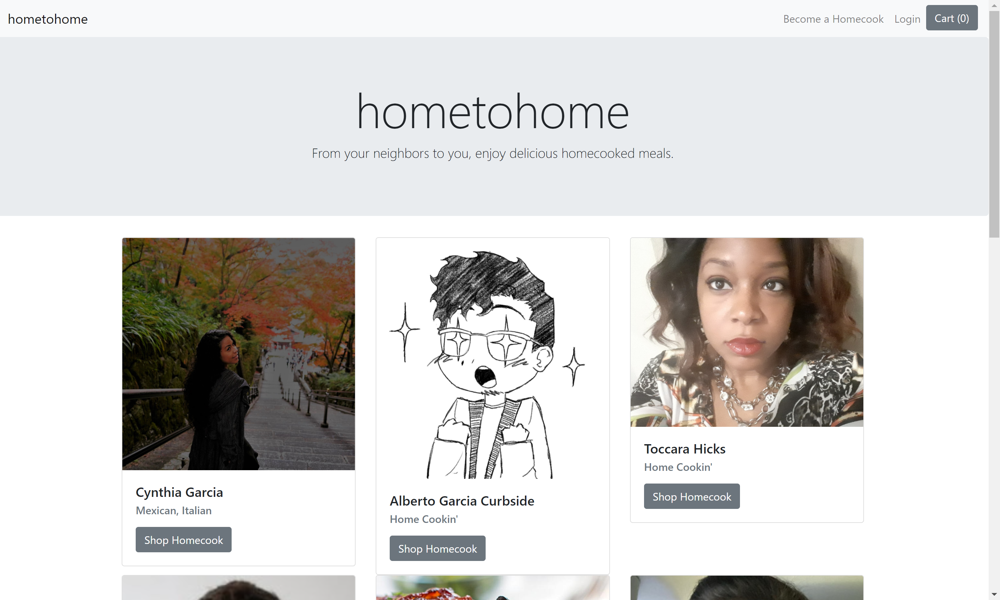

# Home to Home

A MERN e-commerce application to connect entreupenurial homecooks and their hungry neighbors. Hometohome has full database management and secure user authentication.

## Tools

 - React
 - Reactstrap
 - Redux
 - Cloudinary
 - Node
 - MySQL
 - Sequelize
 - Express
 - Passport
 - Bcrypt
 - Stripe
 - Axios
 - APIs

## Access and Installation

Access the live site: [hometohome.herokuapp.com](https://hometohome.herokuapp.com/)

To install and run site locally, intilize with `npm install` or `npm i`. Create local SQL database with `schema.sql`. Then in the root directory run `npm start`. 

## View

## Contributors

 - [Cynthia Garcia](https://github.com/caersun)
 - [Amanda Neal](https://github.com/amandaneal1131)
 - [Manu](https://github.com/manu-austin)
 - [Toccara Hicks](https://github.com/Toccara)

## License

Licensed under the MIT license
